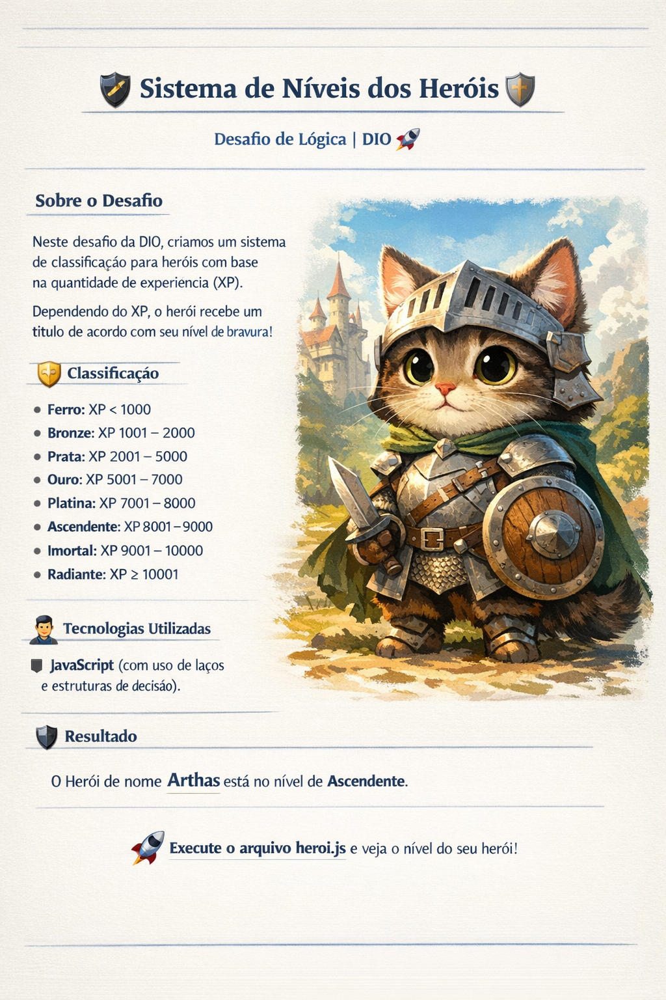

# 🏰 Sistema de Níveis de Heróis (Hero Level System)
## 🧙‍♂️ Descrição do Projeto

#### Este projeto foi desenvolvido como parte de um desafio da plataforma DIO, com o objetivo de praticar os fundamentos da lógica de programação utilizando JavaScript.

#### A aplicação simula um sistema de progressão de níveis de um herói, onde o nível é determinado com base na quantidade de experiência (XP) acumulada.

#### De forma simples, clara e didática, o projeto demonstra como tomar decisões no código a partir de regras bem definidas.

#### ⚔️ Porque todo herói — até um gatinho medieval aventureiro — merece saber seu verdadeiro nível!

## 🎯 Objetivo do Desafio

#### Criar um programa que:

- Armazene o nome e a quantidade de XP de um herói

- Utilize estruturas condicionais para definir o nível do herói

- Exiba no terminal uma mensagem informando:

- Nome do herói

- Nível correspondente ao XP

## 🧩 Conceitos Utilizados

#### Durante o desenvolvimento, foram aplicados os seguintes conceitos:

✅ Variáveis (let) \
✅ Operadores lógicos e relacionais\
✅ Estruturas de decisão (if / else if / else)\
✅ Laços de repetição (while e for)\
✅ Template Strings (interpolação de variáveis)

## 🗺️ Tabela de Níveis 

| XP do Herói	| Nível |
| --- | --
| Menor que 1.000 |	Ferro |
| 1.001 – 2.000	| Bronze |
| 2.001 – 5.000	| Prata |
| 5.001 – 7.000 |	Ouro |
| 7.001 – 8.000	| Platina |
| 8.001 – 9.000	| Ascendente |
| 9.001 – 10.000 | Imortal |
| Acima de 10.000	| Radiante |

---
## 🛠️ Como Executar o Projeto
Pré-requisitos

- Node.js instalado

### Passos

```
node heroi.js
```


O resultado será exibido diretamente no terminal.

## 📸 Preview do Herói





# 🐾 Um pequeno herói, grandes batalhas e muita XP!

### 🚀 Aprendizados

#### Este desafio reforçou conceitos essenciais da programação, principalmente:

- Como estruturar regras de negócio

- Como evitar verificações desnecessárias usando else if

- Diferença prática entre for e while

- Escrita de código mais legível e organizado

#### 📚 Próximos Passos

- Transformar a lógica em uma função reutilizável

- Exibir o nível em tempo real durante o ganho de XP

- Criar testes simples para validação

- Evoluir para um mini RPG em JavaScript 🎮

### 👨‍💻 Autor

#### Desenvolvido por Haslan de Oliveira 
🚀 Em constante evolução no mundo do desenvolvimento